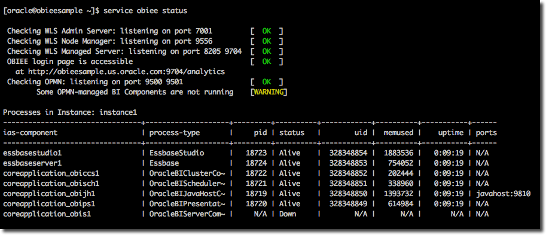
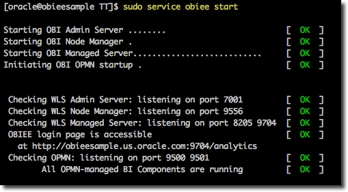
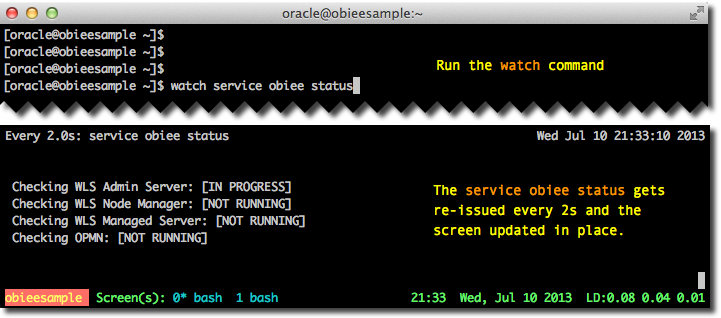

# init.d script for OBIEE

Use this script to install OBIEE as a 'service' on Linux, enabling it to be brought up automagically on bootup, and shutdown when the machine shuts down.

## Installation

The installation will need to be as **root** user, or using `sudo`.

1. Install the init.d script

		sudo cp init.d/obiee /etc/init.d/obiee

2. Make it executable

		sudo chmod 750 /etc/init.d/obiee

3. Install it as a service

		sudo chkconfig --add obiee

4. Copy the default configuration file

		sudo cp sysconfig/obiee /etc/sysconfig/

5. Update the configuration file for your environment:

	* `FMW_HOME` - *The FMW Home folder, eg `/u01/app/oracle/product/fmw`*
	* `ORACLE_OWNR` - *The OS owner under which OBIEE should be managed*
	* `LOGPATH` - *Folder in which to store log files - change if you don't want them in `/var/log`*
	* You _may_ need to change `LSOF_PATH` in `/etc/init.d/obiee` if the binary is not at `/usr/sbin/lsof` - check using `whereis lsof`

If you have multiple OBIEE environments on the same server you can call the script a different name, eg `/etc/init.d/obiee-dev`, `/etc/init.d/obiee-test`, etc, and point each one to a different `/etc/sysconfig/obiee` file.

## Syntax

	service obiee <start|stop|restart|status>

### OBI Status

	$ service obiee status

	 Checking WLS Admin Server: listening on port 7001         [  OK  ]
	 Checking WLS Node Manager: listening on port 9556         [  OK  ]
	 Checking WLS Managed Server: listening on port 8205 9704  [  OK  ]
	 Checking OPMN: listening on port 9500 9501                [  OK  ]
		All OPMN-managed BI Components are running         [  OK  ]

### Start

	$ service obiee start

	Starting OBI Admin Server .......                          [  OK  ]
	Starting OBI Node Manager .                                [  OK  ]
	Starting OBI Managed Server.........                       [  OK  ]
	Initiating OBI OPMN startup .                              [  OK  ]

Each component has a timeout associated with it, after which the start process will fail. Change the appropriate `_START_TIMEOUT` values in the script if you want it to wait longer.

### Stop

	$ service obiee stop

	Shutting down OPMN and BI Components.                      [  OK  ]
	Shutting down OBI Managed Server.                          [  OK  ]
	Shutting down OBI Node Manager..                           [  OK  ]
	Shutting down OBI Admin Server.                            [  OK  ]

Each component has a timeout associated with it, after which the process will be forceably killed. Change the appropriate `_STOP_TIMEOUT` values in the script if you want it to wait longer.

### Restart

	$ service obiee restart

	Shutting down OPMN and BI Components.                      [  OK  ]
	Shutting down OBI Managed Server.                          [  OK  ]
	Shutting down OBI Node Manager..                           [  OK  ]
	Shutting down OBI Admin Server.                            [  OK  ]

	Starting OBI Admin Server .......                          [  OK  ]
	Starting OBI Node Manager .                                [  OK  ]
	Starting OBI Managed Server.........                       [  OK  ]
	Initiating OBI OPMN startup .                              [  OK  ]

## boot.properties

So that you are not prompted each time for credentials when starting/stopping the Admin and Managed servers, set up the boot.properties file as detailed here : http://docs.oracle.com/cd/E28280_01/web.1111/e13708/overview.htm#i1068920

## Enabling OBIEE OS user to run start/stop

Because this script, by necessity, writes a lock file to a restricted area of the system, it should always be invoked as root when starting or stopping OBIEE. To enable this, `sudo` access can be selectively granted to the OS user under which OBIEE run. Add the following to `/etc/sudoers`, assuming you want the user `oracle` to be granted the access:

	Cmnd_Alias STOP_OBI_SERVICE = /sbin/service obiee stop
	Cmnd_Alias START_OBI_SERVICE = /sbin/service obiee start
	Cmnd_Alias RESTART_OBI_SERVICE = /sbin/service obiee restart
	oracle ALL=NOPASSWD: STOP_OBI_SERVICE,START_OBI_SERVICE,RESTART_OBI_SERVICE

Once this is done, you can use the following: 

	sudo service obiee stop
	sudo service obiee start
	sudo service obiee restart

The `status` command doesn't need root privilege to run, so can be run as root, or the OBIEE OS user

	service obiee status

## Bonus

Use the `watch` command to keep an eye on the status of the service, perhaps whilst it's starting up to see when it's ready: 

	watch service obiee status

## TODO / Known Issues

See https://github.com/RittmanMead/scripts/issues
